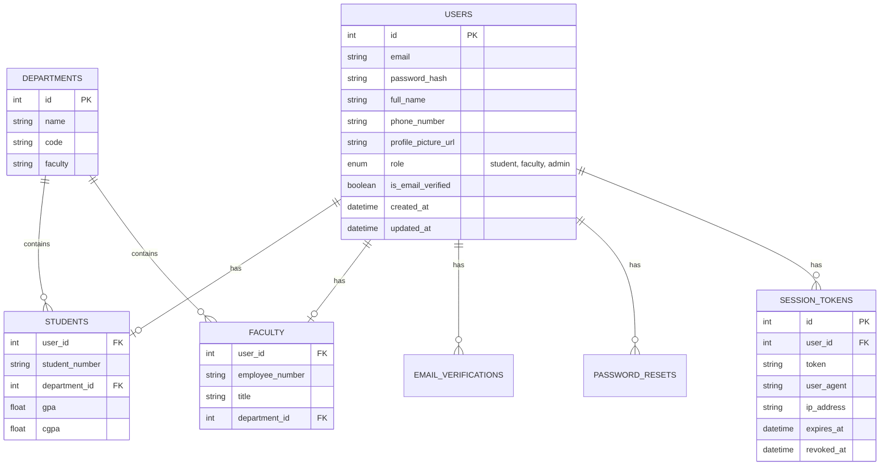

# Database Schema Documentation

## 1. ER Diagram

Aşağıda Part 1 kapsamındaki tabloların ilişkisel yapısı gösterilmektedir:

## 2. Tablo Açıklamaları

### 2.1. users

Sistemin ana kullanıcı tablosudur. Tüm roller (öğrenci, akademisyen, idari) bu tabloda tutulur.

- **id:** Benzersiz kullanıcı ID'si (Primary Key).
- **email:** Kullanıcının giriş yapmak için kullandığı benzersiz e-posta adresi.
- **password_hash:** bcrypt ile hash'lenmiş şifre.
- **role:** Kullanıcının rolü (student, faculty, admin).
- **is_email_verified:** Email doğrulama durumu.

### 2.2. students

Öğrencilere özgü bilgileri tutan tablodur. `users` tablosu ile 1-1 ilişkisi vardır.

- **user_id:** `users` tablosuna referans (Foreign Key).
- **student_number:** Benzersiz öğrenci numarası.
- **department_id:** `departments` tablosuna referans.

### 2.3. faculty

Akademik personele özgü bilgileri tutan tablodur. `users` tablosu ile 1-1 ilişkisi vardır.

- **user_id:** `users` tablosuna referans (Foreign Key).
- **employee_number:** Benzersiz personel sicil numarası.
- **title:** Unvan (Prof., Doç. vb.).

### 2.4. departments

Üniversite bölümlerini tutan tablodur.

- **name:** Bölüm adı (Bilgisayar Mühendisliği vb.).
- **code:** Bölüm kodu (CENG vb.).
- **faculty:** Bağlı olduğu fakülte adı.

### 2.5. session_tokens

Kullanıcı oturumlarını yönetmek için refresh token'ları saklar.

- **token:** JWT refresh token.
- **expires_at:** Token'ın geçerlilik süresi.
- **revoked_at:** Token iptal edildiğinde (logout) set edilir.

### 2.6. email_verifications & password_resets

Geçici token'ları saklayan tablolardır.

- Belirli bir süre sonra expire olurlar.
- Kullanıldıklarında `used_at` alanı set edilir.
