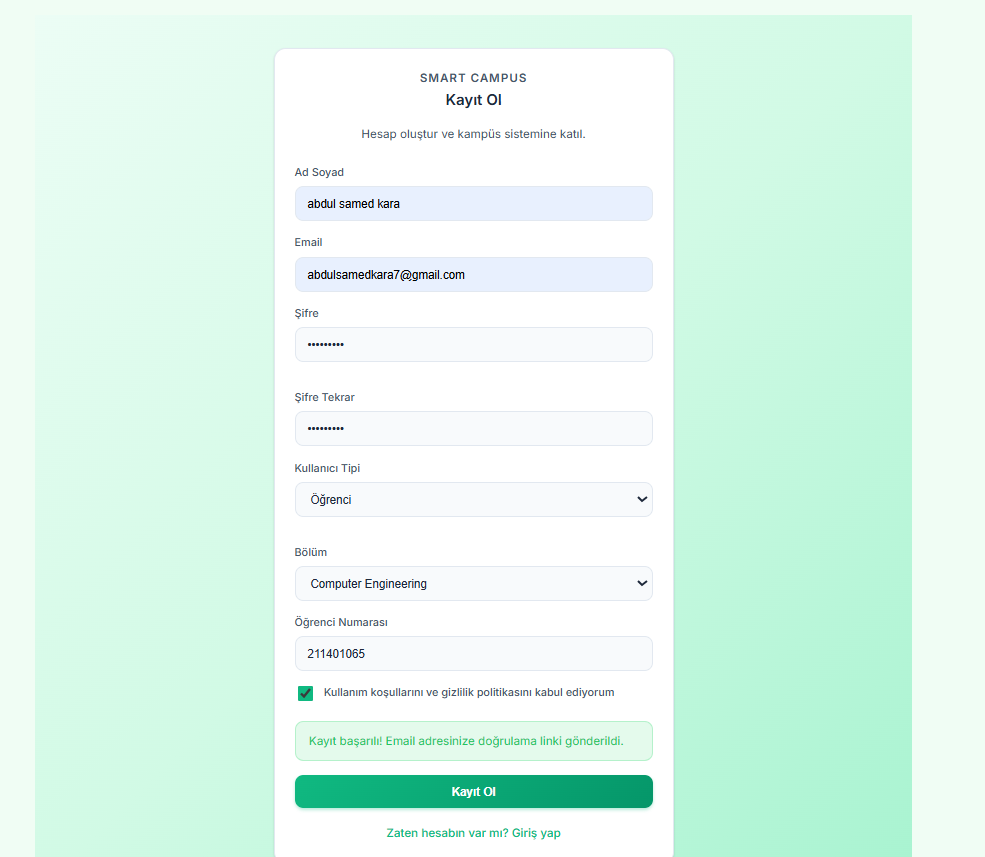
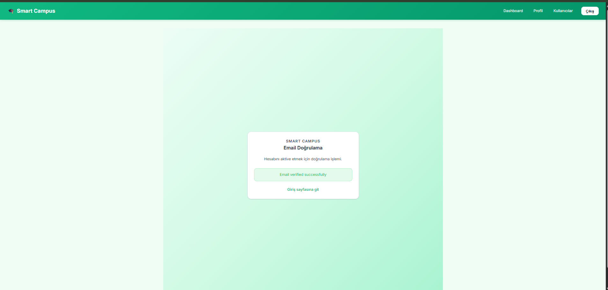
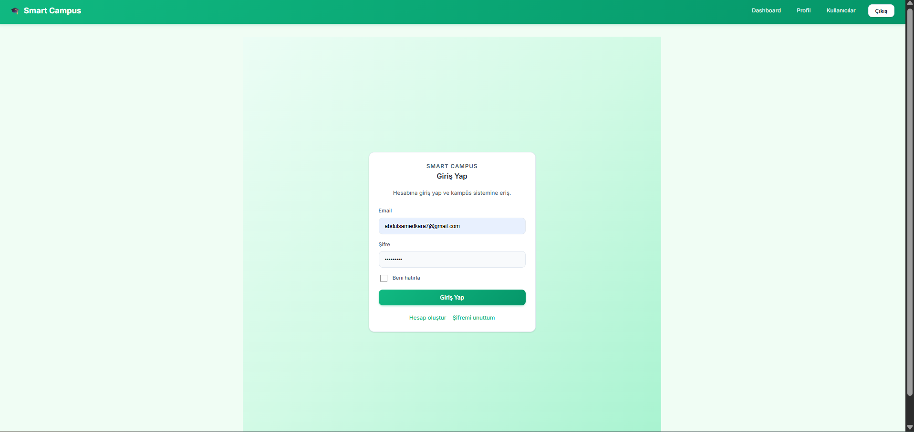
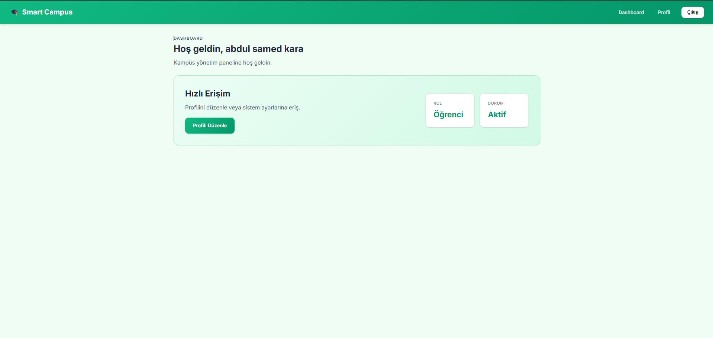
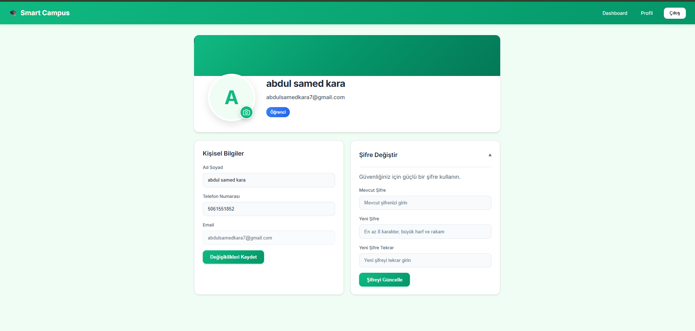

# Kullanıcı Kılavuzu - Part 1: Kimlik Doğrulama ve Profil

## 1. Kayıt Olma (Register)

Sisteme yeni bir kullanıcı olarak kaydolmak için aşağıdaki adımları izleyin:

1. Ana sayfada veya giriş sayfasında bulunan **"Kayıt Ol"** butonuna tıklayın.
2. Kayıt formunu doldurun:
   * **Ad Soyad:** Tam adınızı girin.
   * **Email:** Üniversite e-posta adresinizi girin.
   * **Şifre:** En az 8 karakter, bir büyük harf ve bir rakam içeren güçlü bir şifre belirleyin.
   * **Rol:** Öğrenci veya Akademisyen seçimi yapın.
   * **Numara:** Rolünüze göre Öğrenci veya Personel numaranızı girin.
   * **Bölüm:** Bağlı olduğunuz bölümü listeden seçin.
3. Kullanım koşullarını kabul edin ve **"Kayıt Ol"** butonuna tıklayın.
4. Başarılı kayıt sonrası e-posta adresinize bir doğrulama bağlantısı gönderilecektir.

## 2. Email Doğrulama

Hesabınızı aktif hale getirmek için e-posta doğrulamasını tamamlamanız gerekir:

1. E-posta kutunuzu kontrol edin.
2. Gelen doğrulama mailindeki bağlantıya tıklayın.
3. Yönlendirildiğiniz sayfada **"Email Verified Successfully"** mesajını gördüğünüzde hesabınız aktif olmuştur.
4. Artık giriş yapabilirsiniz.

## 3. Giriş Yapma (Login)

Hesabınıza erişmek için:

1. **Giriş Yap** sayfasına gidin.
2. Email ve şifrenizi girin.
3. **"Giriş Yap"** butonuna tıklayın.
4. Başarılı giriş sonrası **Dashboard** (Kontrol Paneli) sayfasına yönlendirileceksiniz.

### 3.1. Dashboard (Kontrol Paneli)

Giriş yaptıktan sonra sizi karşılayan ana ekran:

## 4. Profil Yönetimi

Profil bilgilerinizi görüntülemek ve güncellemek için:

1. Üst menüden **"Profil"** bağlantısına tıklayın.
2. Açılan sayfada kişisel bilgilerinizi görebilirsiniz.
3. **Bilgileri Güncelle** kartında Ad Soyad ve Telefon numaranızı değiştirebilirsiniz.
4. **Değişiklikleri Kaydet** butonuna basarak güncellemeyi tamamlayın.

### 4.1. Profil Fotoğrafı Yükleme

1. Profil sayfasının en üstündeki yeşil alanda bulunan profil fotoğrafı (veya baş harf) üzerindeki **Kamera** ikonuna tıklayın.
2. Bilgisayarınızdan bir fotoğraf seçin (JPG veya PNG).
3. Fotoğraf otomatik olarak yüklenecek ve profilinizde güncellenecektir.

### 4.2. Şifre Değiştirme

1. Profil sayfasında **"Şifre Değiştir"** başlığına tıklayarak bölümü açın.
2. **Mevcut Şifre**, **Yeni Şifre** ve **Yeni Şifre Tekrar** alanlarını doldurun.
3. **"Şifreyi Güncelle"** butonuna tıklayın.

## 5. Şifremi Unuttum

Şifrenizi hatırlamıyorsanız:

1. Giriş sayfasında **"Şifremi unuttum"** bağlantısına tıklayın.
2. Kayıtlı e-posta adresinizi girin ve gönderin.
3. E-postanıza gelen şifre sıfırlama bağlantısına tıklayın.
4. Yeni şifrenizi belirleyerek işlemi tamamlayın.
