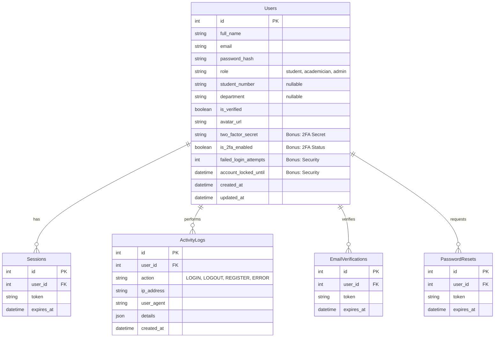

# Smart Campus - Database Schema

## 1. ER Diagram

Aşağıdaki diyagram, veritabanı tabloları arasındaki ilişkileri göstermektedir.

---

## 2. Tablo Açıklamaları

### `Users` Tablosu

Sistemin ana tablosudur. Tüm kullanıcı rolleri (Öğrenci, Akademisyen, Admin) bu tabloda tutulur.

* **Bonus Alanlar:**
  * `two_factor_secret`: 2FA (TOTP) için kullanıcının gizli anahtarı.
  * `is_2fa_enabled`: Kullanıcının 2FA kullanıp kullanmadığı.
  * `failed_login_attempts`: Hatalı giriş sayacı (Account Lockout için).
  * `account_locked_until`: Hesabın ne zamana kadar kilitli kalacağı.

### `ActivityLogs` Tablosu (Bonus)

Kullanıcıların sistemdeki hareketlerini ve güvenlik olaylarını kayıt altına alır.

* `action`: Yapılan işlemin türü (LOGIN, UPDATE_PROFILE, ENABLE_2FA vb.)
* `ip_address` & `user_agent`: İşlemin yapıldığı cihaz ve ağ bilgisi.
* **Kullanım:** Admin panelindeki "Sistem Logları" sayfasında görüntülenir.

### `EmailVerifications` & `PasswordResets`

Güvenlik süreçleri için geçici token'ları tutan tablolardır. Token'ların belirli bir geçerlilik süresi (expiry) vardır.

---

## 3. İndeksler (Indexes)

Performans için aşağıdaki alanlarda B-Tree indeksleri oluşturulmuştur:

* `users(email)`: Giriş işlemlerini hızlandırmak için (Unique).
* `activity_logs(user_id)`: Belirli bir kullanıcının loglarını hızlı sorgulamak için.
* `activity_logs(created_at)`: Tarih bazlı log sıralaması ve filtrelemesi için.
