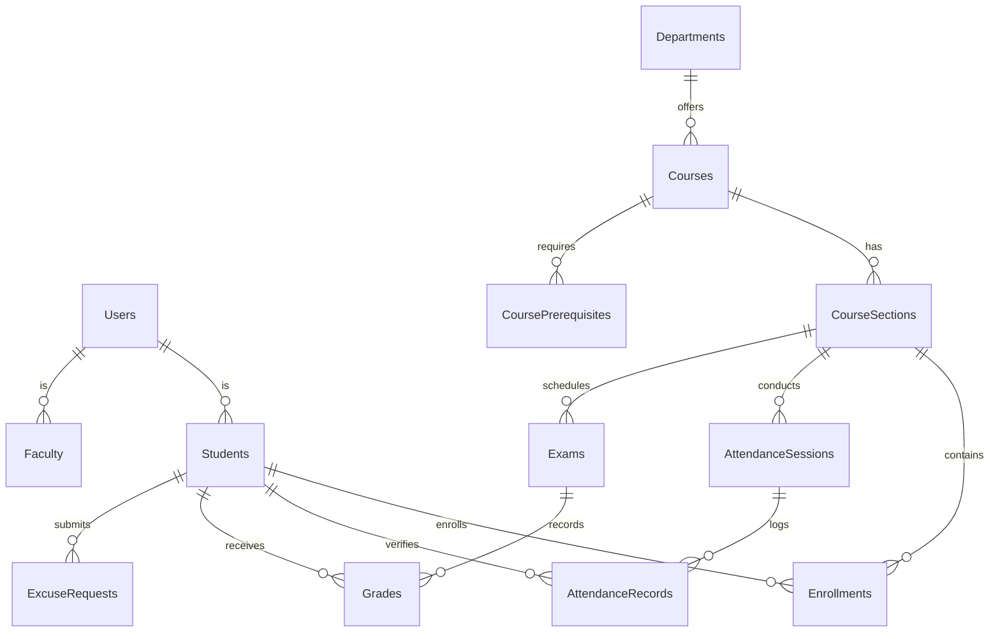

# Smart Campus Veritabanı Şema Güncellemesi (Part 2)

Bu belge, Akademik Yönetim, Yoklama ve Notlandırma dahil olmak üzere Part 2 özelliklerini desteklemek için uygulanan veritabanı şema güncellemelerini detaylandırır.

## 🗄️ Yeni & Güncellenen Tablolar

### 1. Akademik Yapı

**`departments` (Bölümler)**
- `id` (PK)
- `name` (String) - Örn: "Bilgisayar Mühendisliği"
- `code` (String) - Örn: "CENG"

**`courses` (Dersler)**
- `id` (PK)
- `code` (String) - Örn: "CENG301"
- `name` (String)
- `credit` (Integer) - Yerel kredi
- `ects` (Integer) - AKTS
- `department_id` (FK -> departments.id)
- `semester` (Integer)
- `theoretical_hours` (Integer)
- `practical_hours` (Integer)

**`course_prerequisites` (Ders Ön Koşulları)**
- `course_id` (FK -> courses.id)
- `prerequisite_id` (FK -> courses.id)
- *Ders kısıtlamaları için özyinelemeli (recursive) ilişkileri tanımlar.*

**`course_sections` (Ders Şubeleri)**
- `id` (PK)
- `course_id` (FK -> courses.id)
- `section_number` (Integer)
- `instructor_id` (FK -> users.id, rol='faculty')
- `capacity` (Integer)
- `schedule` (JSON) - Örn: `[{"day": "Monday", "startTime": "09:00", "endTime": "11:00", "room": "Z-06"}]`

### 2. Kayıt Sistemi

**`enrollments` (Kayıtlar)**
- `id` (PK)
- `student_id` (FK -> students.id)
- `section_id` (FK -> course_sections.id)
- `status` (Enum: 'ACTIVE', 'DROPPED', 'WAITLIST')
- `enrolled_at` (Date)

### 3. Yoklama Sistemi (GPS & QR)

**`attendance_sessions` (Yoklama Oturumları)**
- `id` (PK)
- `section_id` (FK -> course_sections.id)
- `start_time` (Date)
- `end_time` (Date)
- `qr_code` (String, dinamik)
- `latitude` (Float, Eğitmenin konumu)
- `longitude` (Float, Eğitmenin konumu)
- `radius` (Integer, metre cinsinden izin verilen aralık)
- `status` (Enum: 'ACTIVE', 'FINISHED')

**`attendance_records` (Yoklama Kayıtları)**
- `id` (PK)
- `session_id` (FK -> attendance_sessions.id)
- `student_id` (FK -> students.id)
- `status` (Enum: 'PRESENT', 'ABSENT', 'LATE', 'EXCUSED')
- `check_in_time` (Date)
- `latitude` (Float, öğrencinin check-in konumu)
- `longitude` (Float, öğrencinin check-in konumu)
- `distance_meters` (Float, mesafe)
- `device_info` (String)

**`excuse_requests` (Mazeret İstekleri)**
- `id` (PK)
- `student_id` (FK -> students.id)
- `section_id` (FK -> course_sections.id)
- `date` (Date)
- `reason` (Text)
- `document_url` (String, dosya yolu)
- `status` (Enum: 'PENDING', 'APPROVED', 'REJECTED')

### 4. Notlandırma Sistemi

**`exams` (Sınavlar)**
- `id` (PK)
- `section_id` (FK -> course_sections.id)
- `type` (Enum: 'MIDTERM', 'FINAL', 'PROJECT', 'QUIZ')
- `percentage` (Integer, ağırlık %)
- `date` (Date)

**`grades` (Notlar)**
- `id` (PK)
- `exam_id` (FK -> exams.id)
- `student_id` (FK -> students.id)
- `score` (Float)

---

## 🔗 ER Diyagramı (Basitleştirilmiş)

Bu şema güncellemesi, Smart Campus Part 2 dağıtımı için gereksinimleri tam olarak desteklemektedir.
