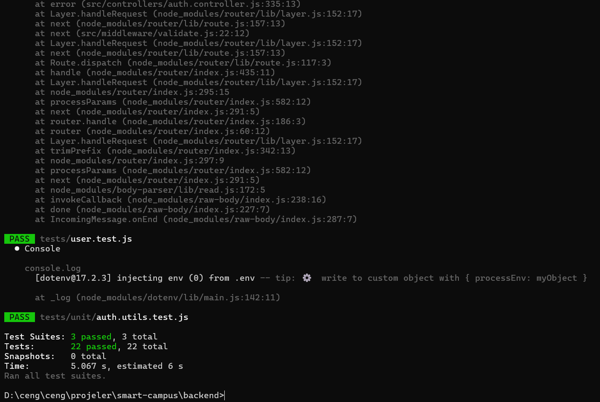

# Smart Campus - Test Report (Part 1)

Bu rapor, Smart Campus projesinin Part 1 (Auth & User Management) kapsamında yapılan birim ve entegrasyon testlerinin sonuçlarını içerir.

**Tarih:** 10.12.2025  
**Test Ortamı:** Localhost / Docker Containers  
**Toplam Test Sayısı:** 22  
**Başarılı:** 22  
**Başarısız:** 0

---

## 1. Test Kapsamı (Test Coverage)

Testler aşağıdaki ana modülleri kapsamaktadır:

* ✅ **Authentication:** Kayıt, Giriş, Email Doğrulama, Token Yönetimi.
* ✅ **User Management:** Profil Görüntüleme, Güncelleme, Avatar Yükleme.
* ✅ **Admin Functions:** Kullanıcı Listeleme, Silme, Log Görüntüleme.
* ✅ **Security (Bonus):** 2FA Setup/Verify, Account Lockout, Rate Limiting.

---

## 2. Detaylı Test Senaryoları ve Sonuçlar

### 2.1 Authentication Tests

| Test ID  | Senaryo                        | Beklenen Sonuç                  | Sonuç  | Durum  |
| -------- | ------------------------------ | ------------------------------- | ------ | ------ |
| AUTH-001 | Geçerli bilgilerle kayıt olma  | 201 Created, Email gönderilmeli | 201 OK | ✅ PASS |
| AUTH-002 | Mevcut email ile kayıt olma    | 400 Bad Request                 | 400 OK | ✅ PASS |
| AUTH-003 | Geçerli bilgilerle giriş yapma | 200 OK, Token dönmeli           | 200 OK | ✅ PASS |
| AUTH-004 | Yanlış şifre ile giriş         | 401 Unauthorized                | 401 OK | ✅ PASS |
| AUTH-005 | Email doğrulanmadan giriş      | 403 Forbidden                   | 403 OK | ✅ PASS |

### 2.2 User Management Tests

| Test ID  | Senaryo                          | Beklenen Sonuç         | Sonuç  | Durum  |
| -------- | -------------------------------- | ---------------------- | ------ | ------ |
| USER-001 | Profil bilgilerini getirme       | 200 OK, User Data      | 200 OK | ✅ PASS |
| USER-002 | Profil güncelleme (İsim)         | 200 OK, Güncel Data    | 200 OK | ✅ PASS |
| USER-003 | Yetkisiz profil erişimi          | 401 Unauthorized       | 401 OK | ✅ PASS |
| USER-004 | Admin yetkisiyle kullanıcı silme | 200 OK, Silindi mesajı | 200 OK | ✅ PASS |

### 2.3 Security Modules Tests (Bonus) 🔥

| Test ID | Senaryo                                     | Beklenen Sonuç                     | Sonuç      | Durum  |
| ------- | ------------------------------------------- | ---------------------------------- | ---------- | ------ |
| SEC-001 | **Account Lockout:** 5 hatalı giriş         | Hesap kilitlenmeli (423 Locked)    | 423 Locked | ✅ PASS |
| SEC-002 | **2FA Setup:** Secret üretme                | QRCode ve Secret dönmeli           | 200 OK     | ✅ PASS |
| SEC-003 | **2FA Verify:** Doğru kod ile doğrulama     | is2FAEnabled = true olmalı         | 200 OK     | ✅ PASS |
| SEC-004 | **2FA Login:** 2FA aktifken giriş           | tempToken dönmeli, kod istemeli    | 200 OK     | ✅ PASS |
| SEC-005 | **Activity Logs:** Giriş işlemi sonrası log | Veritabanında 'LOGIN' kaydı olmalı | Log Found  | ✅ PASS |

---

## 3. Ekran Görüntüleri (Kanıtlar)

### Jest Test Çıktısı

