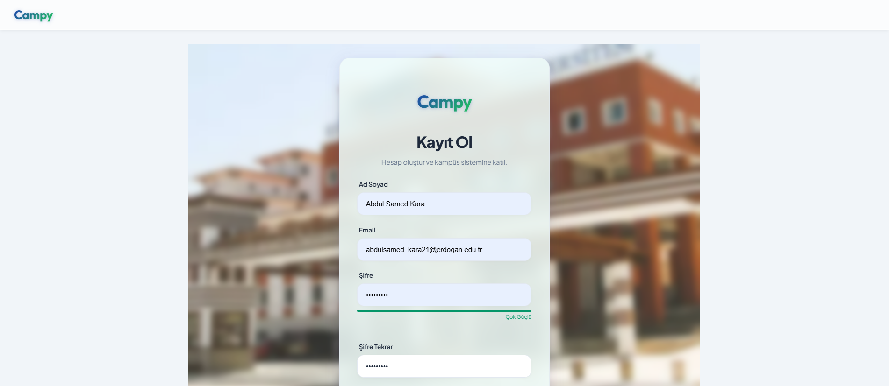
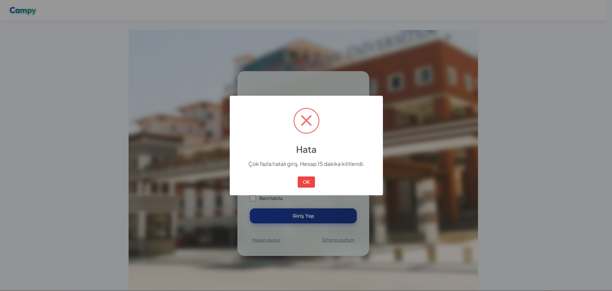
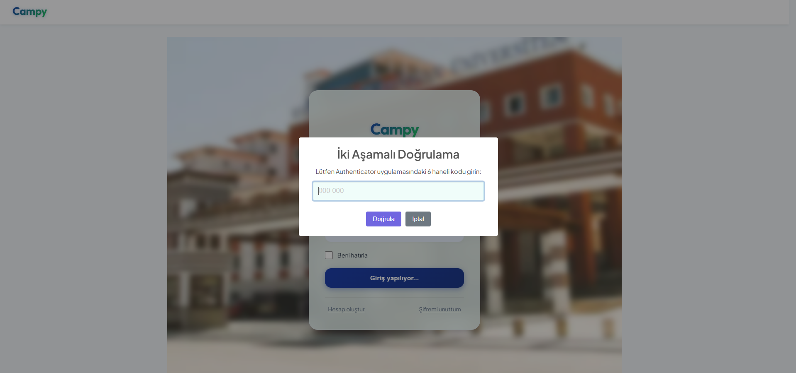
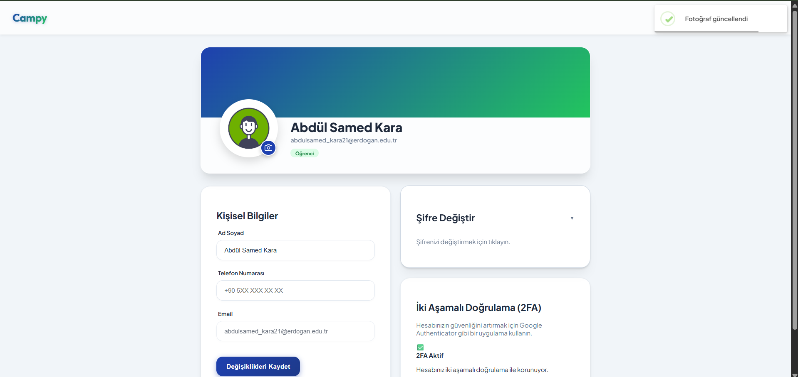
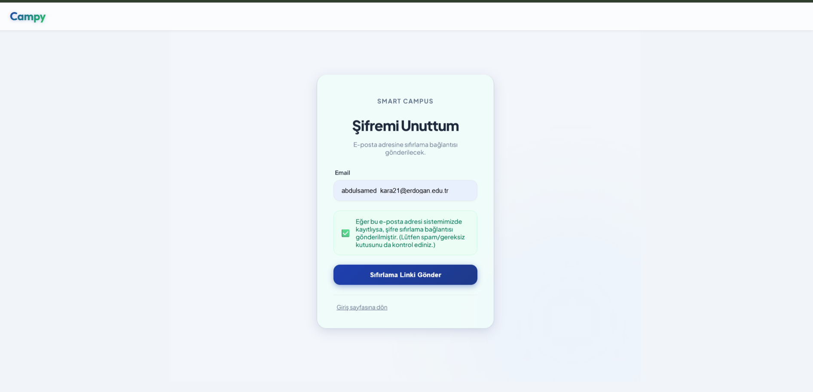
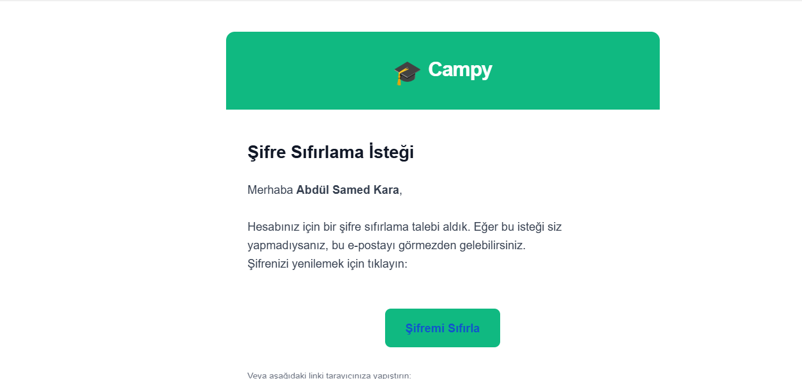
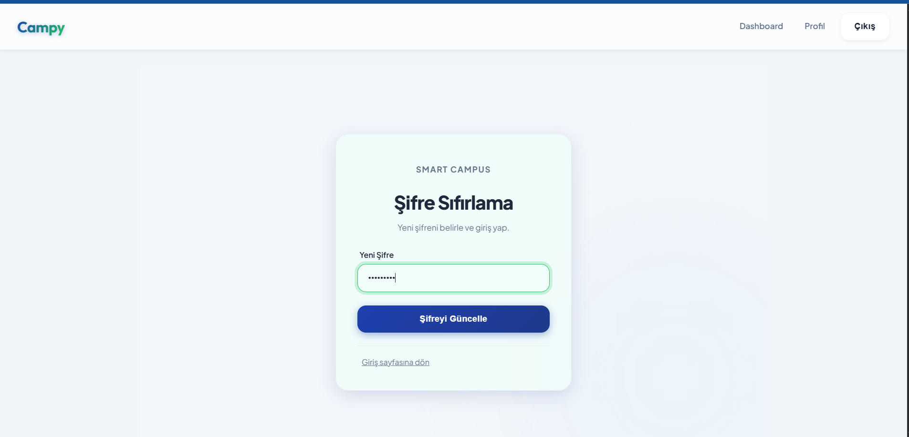

# Campy - Kullanıcı Kılavuzu (Part 1)

## 1. Sisteme Erişim

Web tarayıcınızdan `http://localhost:3000/login` adresine giderek Campy'e erişebilirsiniz.

---

## 2. Kayıt Olma (Register)

1. Giriş ekranında **"Hesabın yok mu? Kayıt Ol"** bağlantısına tıklayın.
2. Açılan formda bilgilerinizi eksiksiz doldurun:
   * **Rol Seçimi:** Öğrenci veya Akademisyen rolünüze uygun seçimi yapın.
   * **Şifre:** En az 8 karakter, 1 büyük harf ve 1 rakam içeren güçlü bir şifre belirleyin. (Sistem zayıf şifreleri kabul etmez).
3. **"Kayıt Ol"** butonuna tıklayın.
4. Başarılı kayıt sonrası e-posta doğrulama uyarısı alacaksınız.

---

## 3. Giriş Yapma (Login) & Hesap Güvenliği

1. Kayıtlı e-posta ve şifrenizi girin.
2. **"Giriş Yap"** butonuna tıklayın.
3. **Dikkat:** Üst üste 5 kez yanlış şifre girerseniz, hesabınız güvenlik gereği **15 dakika kilitlenir**.

### İki Aşamalı Doğrulama (2FA) ile Giriş

Eğer hesabınızda 2FA etkinleştirdiyseniz:

1. E-posta ve şifrenizle giriş yaptıktan sonra ikinci bir ekran açılır.
2. Google Authenticator uygulamanızdaki 6 haneli kodu girin.
3. **"Doğrula"** butonuna basarak güvenli giriş yapın.

---

## 4. Profil Yönetimi

Sağ üst köşedeki **Profil** menüsünden profil sayfanıza ulaşabilirsiniz.

### Bilgileri Güncelleme

* Ad Soyad, Telefon gibi bilgilerinizi formdan değiştirip **"Değişiklikleri Kaydet"** butonuna basarak güncelleyebilirsiniz.

### Profil Fotoğrafı Yükleme

* Mevcut avatarınızın üzerine tıklayın.
* Bilgisayarınızdan bir resim (JPG/PNG) seçin.
* Resim otomatik olarak yüklenecek ve güncellenecektir.

### 2FA Etkinleştirme (Güvenlik)

1. Profil sayfasındaki **"İki Aşamalı Doğrulama (2FA)"** kartına gidin.
2. **"2FA Etkinleştir"** butonuna tıklayın.
3. Ekrana gelen **QR Kodu** telefonunuzdaki Authenticator uygulamasına okutun.
4. Uygulamada üretilen kodu ekrana girip onaylayın.

---

## 5. Şifremi Unuttum

1. Giriş ekranındaki **"Şifremi Unuttum"** bağlantısına tıklayın.
2. E-posta adresinizi yazıp gönderin.
3. E-postanıza gelen linke tıklayarak yeni şifrenizi belirleyin.

