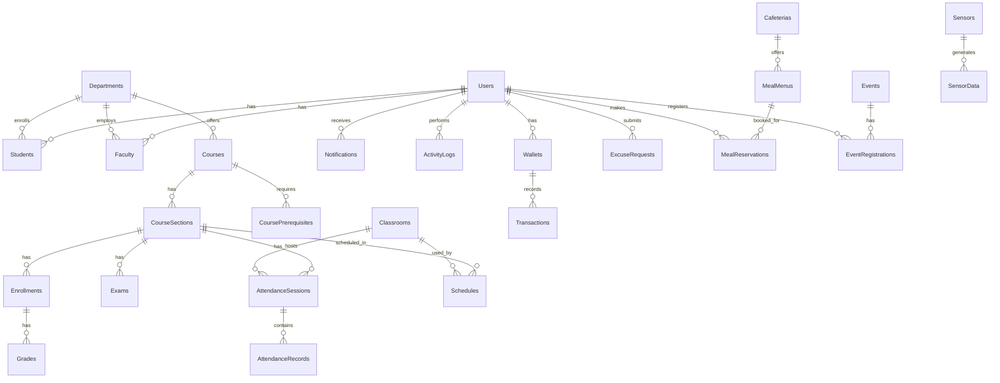

# Smart Campus - Database Schema (Complete)

**Database:** PostgreSQL 14+  
**ORM:** Sequelize 6.x  
**Total Tables:** 30+

---

## 1. Complete ER Diagram



---

## 2. Table Definitions

### 2.1 Core Tables

#### `users`
| Column | Type | Constraints | Description |
|--------|------|-------------|-------------|
| id | SERIAL | PK | |
| email | VARCHAR(255) | UNIQUE, NOT NULL | |
| password_hash | VARCHAR(255) | NOT NULL | bcrypt hash |
| full_name | VARCHAR(255) | NOT NULL | |
| phone_number | VARCHAR(20) | | |
| student_number | VARCHAR(50) | | For students |
| profile_picture_url | VARCHAR(500) | | |
| role | ENUM | NOT NULL | 'student', 'faculty', 'admin' |
| is_email_verified | BOOLEAN | DEFAULT false | |
| failed_login_attempts | INTEGER | DEFAULT 0 | |
| account_locked_until | TIMESTAMP | | |
| two_factor_secret | VARCHAR(255) | | TOTP secret |
| is_2fa_enabled | BOOLEAN | DEFAULT false | |
| created_at | TIMESTAMP | | |
| updated_at | TIMESTAMP | | |

#### `departments`
| Column | Type | Constraints |
|--------|------|-------------|
| id | SERIAL | PK |
| name | VARCHAR(255) | NOT NULL |
| code | VARCHAR(10) | UNIQUE |
| faculty | VARCHAR(255) | |

#### `students`
| Column | Type | Constraints |
|--------|------|-------------|
| id | SERIAL | PK |
| user_id | INTEGER | FK → users |
| department_id | INTEGER | FK → departments |
| advisor_id | INTEGER | FK → faculty |
| gpa | DECIMAL(3,2) | |
| cgpa | DECIMAL(3,2) | |
| enrollment_year | INTEGER | |

#### `faculty`
| Column | Type | Constraints |
|--------|------|-------------|
| id | SERIAL | PK |
| user_id | INTEGER | FK → users |
| department_id | INTEGER | FK → departments |
| title | VARCHAR(100) | |
| office_hours | VARCHAR(255) | |

---

### 2.2 Academic Tables

#### `courses`
| Column | Type | Constraints |
|--------|------|-------------|
| id | SERIAL | PK |
| code | VARCHAR(20) | UNIQUE |
| name | VARCHAR(255) | NOT NULL |
| description | TEXT | |
| credits | INTEGER | |
| ects | INTEGER | |
| weekly_hours | INTEGER | |
| department_id | INTEGER | FK → departments |
| syllabus_url | VARCHAR(500) | |
| deleted_at | TIMESTAMP | Soft delete |

#### `course_prerequisites`
| Column | Type | Constraints |
|--------|------|-------------|
| id | SERIAL | PK |
| course_id | INTEGER | FK → courses |
| prerequisite_id | INTEGER | FK → courses |

#### `course_sections`
| Column | Type | Constraints |
|--------|------|-------------|
| id | SERIAL | PK |
| course_id | INTEGER | FK → courses |
| section_number | INTEGER | |
| semester | VARCHAR(20) | 'Fall', 'Spring' |
| instructor_id | INTEGER | FK → users |
| capacity | INTEGER | |
| enrolled_count | INTEGER | DEFAULT 0 |
| schedule | JSONB | Weekly schedule |

#### `enrollments`
| Column | Type | Constraints |
|--------|------|-------------|
| id | SERIAL | PK |
| student_id | INTEGER | FK → users |
| section_id | INTEGER | FK → course_sections |
| status | ENUM | 'ACTIVE', 'DROPPED', 'COMPLETED' |
| letter_grade | VARCHAR(2) | |
| numeric_grade | DECIMAL(5,2) | |
| advisor_approved | BOOLEAN | DEFAULT false |

#### `exams`
| Column | Type | Constraints |
|--------|------|-------------|
| id | SERIAL | PK |
| section_id | INTEGER | FK → course_sections |
| name | VARCHAR(255) | |
| type | ENUM | 'midterm', 'final', 'quiz' |
| weight | INTEGER | Percentage |
| max_score | DECIMAL | DEFAULT 100 |
| date | DATE | |

#### `grades`
| Column | Type | Constraints |
|--------|------|-------------|
| id | SERIAL | PK |
| exam_id | INTEGER | FK → exams |
| student_id | INTEGER | FK → users |
| score | DECIMAL(5,2) | |
| graded_by | INTEGER | FK → users |
| graded_at | TIMESTAMP | |

---

### 2.3 Attendance Tables

#### `classrooms`
| Column | Type | Constraints |
|--------|------|-------------|
| id | SERIAL | PK |
| name | VARCHAR(255) | |
| building | VARCHAR(100) | |
| room_number | VARCHAR(20) | |
| capacity | INTEGER | |
| latitude | DECIMAL(10,8) | |
| longitude | DECIMAL(11,8) | |
| features | JSONB | |

#### `attendance_sessions`
| Column | Type | Constraints |
|--------|------|-------------|
| id | SERIAL | PK |
| section_id | INTEGER | FK → course_sections |
| classroom_id | INTEGER | FK → classrooms |
| type | ENUM | 'qr', 'gps', 'manual' |
| qr_code | TEXT | Encrypted QR data |
| latitude | DECIMAL(10,8) | |
| longitude | DECIMAL(11,8) | |
| radius | INTEGER | Meters |
| status | ENUM | 'active', 'closed' |
| started_at | TIMESTAMP | |
| ended_at | TIMESTAMP | |

#### `attendance_records`
| Column | Type | Constraints |
|--------|------|-------------|
| id | SERIAL | PK |
| session_id | INTEGER | FK → attendance_sessions |
| student_id | INTEGER | FK → users |
| status | ENUM | 'present', 'absent', 'excused', 'late' |
| check_in_time | TIMESTAMP | |
| latitude | DECIMAL(10,8) | |
| longitude | DECIMAL(11,8) | |
| device_info | JSONB | Anti-spoofing data |

#### `excuse_requests`
| Column | Type | Constraints |
|--------|------|-------------|
| id | SERIAL | PK |
| student_id | INTEGER | FK → users |
| session_id | INTEGER | FK → attendance_sessions |
| reason | TEXT | |
| document_url | VARCHAR(500) | |
| status | ENUM | 'pending', 'approved', 'rejected' |
| reviewed_by | INTEGER | FK → users |

---

### 2.4 Cafeteria Tables

#### `cafeterias`
| Column | Type | Constraints |
|--------|------|-------------|
| id | SERIAL | PK |
| name | VARCHAR(255) | |
| location | VARCHAR(255) | |
| capacity | INTEGER | |
| is_active | BOOLEAN | DEFAULT true |

#### `meal_menus`
| Column | Type | Constraints |
|--------|------|-------------|
| id | SERIAL | PK |
| cafeteria_id | INTEGER | FK → cafeterias |
| date | DATE | |
| meal_type | ENUM | 'lunch', 'dinner' |
| items_json | JSONB | Menu items |
| nutrition_json | JSONB | Calories, etc. |
| price | DECIMAL(10,2) | |
| is_published | BOOLEAN | |

#### `meal_reservations`
| Column | Type | Constraints |
|--------|------|-------------|
| id | SERIAL | PK |
| user_id | INTEGER | FK → users |
| menu_id | INTEGER | FK → meal_menus |
| cafeteria_id | INTEGER | FK → cafeterias |
| meal_type | ENUM | 'lunch', 'dinner' |
| date | DATE | |
| qr_code | TEXT | |
| status | ENUM | 'reserved', 'used', 'cancelled', 'expired' |
| used_at | TIMESTAMP | |

---

### 2.5 Wallet Tables

#### `wallets`
| Column | Type | Constraints |
|--------|------|-------------|
| id | SERIAL | PK |
| user_id | INTEGER | FK → users, UNIQUE |
| balance | DECIMAL(10,2) | DEFAULT 0 |
| currency | VARCHAR(3) | DEFAULT 'TRY' |
| is_active | BOOLEAN | DEFAULT true |

#### `transactions`
| Column | Type | Constraints |
|--------|------|-------------|
| id | SERIAL | PK |
| wallet_id | INTEGER | FK → wallets |
| type | ENUM | 'credit', 'debit' |
| amount | DECIMAL(10,2) | |
| balance_after | DECIMAL(10,2) | |
| reference_type | VARCHAR(50) | 'meal', 'topup', 'refund' |
| reference_id | INTEGER | |
| description | VARCHAR(255) | |

#### `saved_cards`
| Column | Type | Constraints |
|--------|------|-------------|
| id | SERIAL | PK |
| user_id | INTEGER | FK → users |
| card_token | VARCHAR(255) | Tokenized |
| last_four | VARCHAR(4) | |
| card_type | VARCHAR(20) | |
| is_default | BOOLEAN | |

---

### 2.6 Event Tables

#### `events`
| Column | Type | Constraints |
|--------|------|-------------|
| id | SERIAL | PK |
| title | VARCHAR(255) | |
| description | TEXT | |
| category | VARCHAR(100) | |
| date | DATE | |
| start_time | TIME | |
| end_time | TIME | |
| location | VARCHAR(255) | |
| capacity | INTEGER | |
| registered_count | INTEGER | DEFAULT 0 |
| registration_deadline | TIMESTAMP | |
| is_paid | BOOLEAN | DEFAULT false |
| price | DECIMAL(10,2) | |
| status | ENUM | 'draft', 'published', 'cancelled', 'completed' |

#### `event_registrations`
| Column | Type | Constraints |
|--------|------|-------------|
| id | SERIAL | PK |
| event_id | INTEGER | FK → events |
| user_id | INTEGER | FK → users |
| registration_date | TIMESTAMP | |
| qr_code | TEXT | |
| checked_in | BOOLEAN | DEFAULT false |
| checked_in_at | TIMESTAMP | |
| custom_fields_json | JSONB | |

---

### 2.7 Notification Tables

#### `notifications`
| Column | Type | Constraints |
|--------|------|-------------|
| id | SERIAL | PK |
| user_id | INTEGER | FK → users |
| title | VARCHAR(255) | |
| message | TEXT | |
| type | VARCHAR(50) | 'academic', 'attendance', 'meal', 'event', 'system' |
| is_read | BOOLEAN | DEFAULT false |
| created_at | TIMESTAMP | |

#### `notification_preferences`
| Column | Type | Constraints |
|--------|------|-------------|
| id | SERIAL | PK |
| user_id | INTEGER | FK → users, UNIQUE |
| email_academic | BOOLEAN | DEFAULT true |
| email_attendance | BOOLEAN | DEFAULT true |
| email_meal | BOOLEAN | DEFAULT false |
| email_event | BOOLEAN | DEFAULT true |
| push_academic | BOOLEAN | DEFAULT true |
| push_attendance | BOOLEAN | DEFAULT true |
| sms_attendance | BOOLEAN | DEFAULT false |

---

### 2.8 IoT Tables

#### `sensors`
| Column | Type | Constraints |
|--------|------|-------------|
| id | SERIAL | PK |
| name | VARCHAR(255) | |
| type | VARCHAR(50) | 'temperature', 'occupancy', 'energy' |
| location | VARCHAR(255) | |
| unit | VARCHAR(20) | |
| is_active | BOOLEAN | DEFAULT true |

#### `sensor_data`
| Column | Type | Constraints |
|--------|------|-------------|
| id | SERIAL | PK |
| sensor_id | INTEGER | FK → sensors |
| value | DECIMAL(10,4) | |
| timestamp | TIMESTAMP | |

---

### 2.9 Schedule Tables

#### `schedules`
| Column | Type | Constraints |
|--------|------|-------------|
| id | SERIAL | PK |
| section_id | INTEGER | FK → course_sections |
| classroom_id | INTEGER | FK → classrooms |
| day_of_week | INTEGER | 1-5 (Mon-Fri) |
| start_time | TIME | |
| end_time | TIME | |

#### `reservations`
| Column | Type | Constraints |
|--------|------|-------------|
| id | SERIAL | PK |
| classroom_id | INTEGER | FK → classrooms |
| user_id | INTEGER | FK → users |
| date | DATE | |
| start_time | TIME | |
| end_time | TIME | |
| purpose | VARCHAR(255) | |
| status | ENUM | 'pending', 'approved', 'rejected', 'cancelled' |
| approved_by | INTEGER | FK → users |

---

## 3. Indexes

```sql
-- Performance indexes
CREATE INDEX idx_users_email ON users(email);
CREATE INDEX idx_enrollments_student ON enrollments(student_id);
CREATE INDEX idx_enrollments_section ON enrollments(section_id);
CREATE INDEX idx_attendance_session ON attendance_records(session_id);
CREATE INDEX idx_attendance_student ON attendance_records(student_id);
CREATE INDEX idx_transactions_wallet ON transactions(wallet_id);
CREATE INDEX idx_notifications_user ON notifications(user_id);
CREATE INDEX idx_sensor_data_sensor ON sensor_data(sensor_id);
CREATE INDEX idx_sensor_data_timestamp ON sensor_data(timestamp);
```

---

## 4. Migrations

All schema changes are managed through Sequelize migrations in `/backend/migrations/`.

Run migrations:
```bash
npx sequelize-cli db:migrate
```

Rollback:
```bash
npx sequelize-cli db:migrate:undo
```
